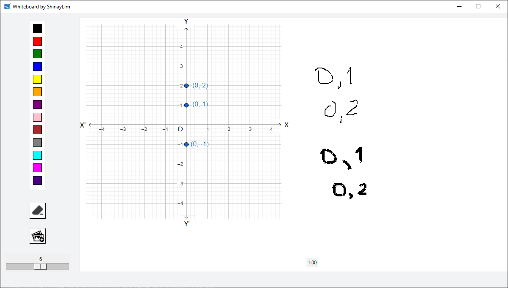

# Whiteboard using python

This is a simple Whiteboard application built using Python and Tkinter, which allows you to draw and import images.

## Features

- Choose from a variety of colors from the color palette.
- Use the slider to adjust the brush size.
- Erase the canvas with the eraser tool.
- Import and display images on the canvas.

## Screenshots




## Prerequisites

- Python 3.x
- Tkinter (usually included in Python standard library)
- Pillow (PIL) library for image processing (can be installed via pip)

## Installation

1. Clone the repository:

```bash
git clone https://github.com/ShinayLim/whiteboard-gui.git
cd Whiteboard
```

2. Install the required libraries using pip:

```bash
pip install pillow
```

## How to Use

1. Run the application:

```bash
python whiteboard.py
```

2. The application window will open, and you can start drawing and using the various features available.

## Screenshots

(Optional: If you want to include some screenshots of your application, you can add them here.)

## License

[MIT License](LICENSE)
